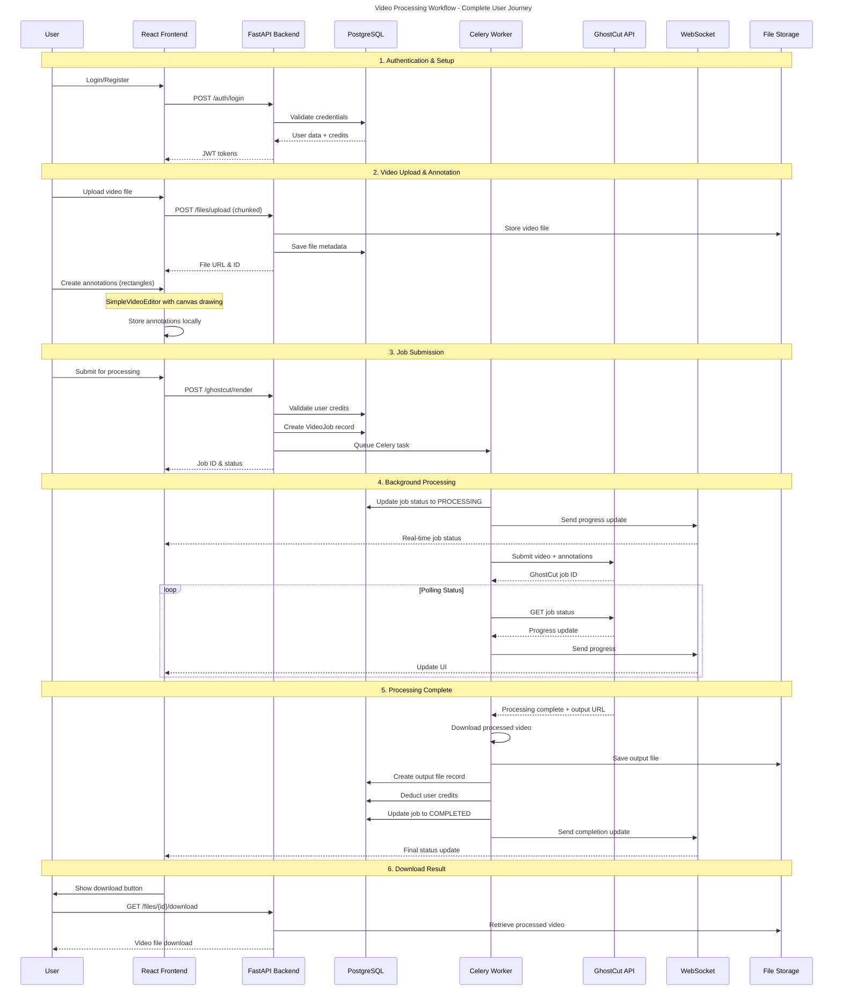
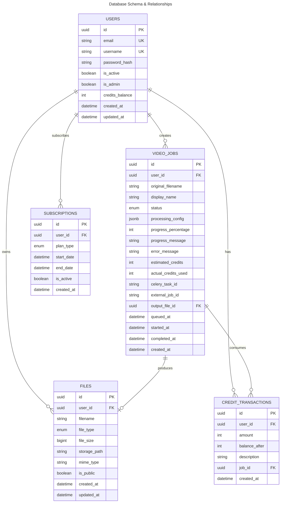
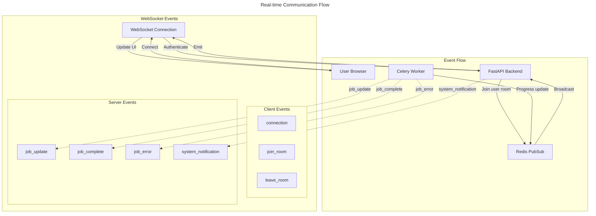
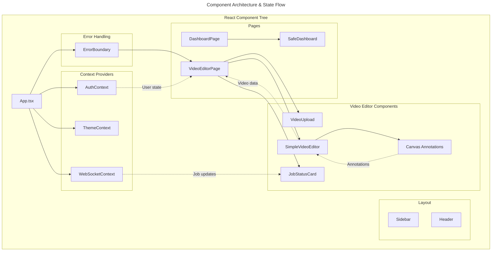

# Video Text Inpainting Service - System Architecture Diagrams

## Overview

This document contains comprehensive Mermaid diagrams that visualize the complete architecture, workflows, and component relationships of the Video Text Inpainting Service. These diagrams are designed to help developers understand the codebase structure and system interactions.

---

## 1. Complete System Architecture

```mermaid
---
title: Video Text Inpainting Service - Complete System Architecture
---

graph TB
    %% User Interface Layer
    subgraph "Frontend - React 19 + TypeScript"
        UI[User Interface]
        
        subgraph "Core Pages"
            VEP[VideoEditorPage]
            DP[DashboardPage]
            LP[LoginPage]
            SP[SettingsPage]
        end
        
        subgraph "Components"
            VU[VideoUpload]
            SVE[SimpleVideoEditor]
            JSC[JobStatusCard]
            EB[ErrorBoundary]
        end
        
        subgraph "Services"
            API[API Client]
            GCA[GhostCut API Client]
            WS[WebSocket Client]
        end
        
        UI --> VEP
        UI --> DP
        VEP --> VU
        VEP --> SVE
        VEP --> JSC
        API --> GCA
        EB -.-> VEP
    end

    %% Backend Services Layer
    subgraph "Backend - FastAPI + SQLAlchemy"
        subgraph "API Routes"
            AUTH["/api/v1/auth"]
            USERS["/api/v1/users"]
            FILES["/api/v1/files"]
            JOBS["/api/v1/jobs"]
            GC["/api/v1/ghostcut"]
            ADMIN["/api/v1/admin"]
        end
        
        subgraph "Core Services"
            JWT[JWT Handler]
            DB[Database Models]
            CFG[Configuration]
        end
        
        subgraph "WebSocket"
            WSH[WebSocket Handler]
            JU[Job Updates]
        end
    end

    %% Worker Layer
    subgraph "Celery Workers"
        CA[Celery App]
        GT[GhostCut Tasks]
        VT[Video Tasks]
        
        CA --> GT
        CA --> VT
    end

    %% External Services Layer
    subgraph "External APIs"
        GCAPI[GhostCut/Zhaoli API]
        AWS[AWS Services]
        S3[S3 Storage]
    end

    %% Data Layer
    subgraph "Data Storage"
        PG[(PostgreSQL 15)]
        RD[(Redis 7)]
        FS[File Storage]
    end

    %% Infrastructure Layer
    subgraph "Docker Infrastructure"
        NGINX[Nginx Reverse Proxy]
        DC[Docker Compose]
        FLOWER[Flower Monitor]
    end

    %% Connections
    UI -->|HTTP/WS| NGINX
    NGINX --> AUTH
    NGINX --> FILES
    NGINX --> GC
    
    AUTH --> JWT
    FILES --> DB
    GC --> GT
    JOBS --> DB
    
    GT -->|API Calls| GCAPI
    VT --> FS
    
    DB --> PG
    CA --> RD
    WSH --> RD
    
    WS -->|Real-time Updates| WSH
    JU --> WS
    
    FLOWER --> CA

    %% Styling
    classDef frontend fill:#e1f5fe
    classDef backend fill:#f3e5f5
    classDef worker fill:#fff3e0
    classDef external fill:#ffebee
    classDef data fill:#e8f5e8
    classDef infra fill:#fafafa

    class UI,VEP,DP,LP,SP,VU,SVE,JSC,EB,API,GCA,WS frontend
    class AUTH,USERS,FILES,JOBS,GC,ADMIN,JWT,DB,CFG,WSH,JU backend
    class CA,GT,VT worker
    class GCAPI,AWS,S3 external
    class PG,RD,FS data
    class NGINX,DC,FLOWER infra
```



---

## 2. Video Processing Workflow



---

## 3. Database Schema & Relationships



---

## 4. API Endpoint Structure

```mermaid
---
title: API Endpoint Structure
---

graph LR
    subgraph "Authentication Endpoints"
        A1[POST /auth/login]
        A2[POST /auth/register]
        A3[POST /auth/refresh]
        A4[POST /auth/logout]
    end
    
    subgraph "User Management"
        U1[GET /users/me]
        U2[PUT /users/me]
        U3[GET /users/credits]
    end
    
    subgraph "File Operations"
        F1[POST /files/upload]
        F2[GET /files/{id}]
        F3[GET /files/{id}/download]
        F4[DELETE /files/{id}]
        F5[POST /chunked-upload/start]
        F6[POST /chunked-upload/chunk]
        F7[POST /chunked-upload/complete]
    end
    
    subgraph "Job Management"
        J1[GET /jobs]
        J2[GET /jobs/{id}]
        J3[POST /jobs/{id}/cancel]
        J4[DELETE /jobs/{id}]
    end
    
    subgraph "GhostCut Processing"
        G1[POST /ghostcut/render]
        G2[GET /ghostcut/jobs/{id}]
        G3[POST /ghostcut/jobs/{id}/cancel]
        G4[GET /ghostcut/jobs]
    end
    
    subgraph "Admin Operations"
        AD1[GET /admin/users]
        AD2[GET /admin/jobs]
        AD3[GET /admin/system-stats]
    end

    %% Flow connections
    A1 --> U1
    F1 --> G1
    G1 --> J2
    J2 --> F3
```

---

## 5. Real-time Communication Flow



---

## 6. Component Architecture & State Flow



---

## Key Architecture Features

### 🏗️ **System Architecture**
- **Microservices**: Frontend (React), Backend (FastAPI), Workers (Celery)
- **Container Orchestration**: Docker Compose with health checks
- **Real-time Updates**: WebSocket for job progress
- **Scalable Workers**: Multiple Celery instances with Redis broker

### 🔄 **Video Processing Pipeline**
1. **Upload**: Chunked upload for large files
2. **Annotation**: Custom canvas-based rectangle drawing
3. **Submission**: Validates credits and queues job
4. **Processing**: Celery worker calls GhostCut API
5. **Polling**: Real-time status updates via WebSocket
6. **Completion**: Download processed video

### 🔐 **Security & Authentication**
- **JWT Tokens**: Access + refresh token pattern
- **Role-based Access**: User/Admin permissions
- **Credit System**: Pay-per-use with transaction tracking
- **Input Validation**: Pydantic models throughout

### 📊 **Data Management**
- **PostgreSQL**: Relational data with proper foreign keys
- **Redis**: Caching and message broker
- **File Storage**: Local storage with S3 integration planned
- **Type Safety**: Strong typing in both Python and TypeScript

### 🔧 **Development Features**
- **Error Boundaries**: React error handling
- **Health Checks**: All services monitored
- **Logging**: Structured logging to files
- **Testing**: Unit and integration test support

---

## Current System Status

### ✅ Completed Components
- **Frontend**: Working with custom video editor and error handling
- **Backend**: All APIs implemented, ready for GhostCut integration  
- **Database**: Schema complete with all required tables
- **Docker Setup**: Multi-container orchestration with health checks
- **Error Handling**: React ErrorBoundary and comprehensive logging

### ⏳ In Progress / Pending
- **Authentication**: Temporarily bypassed for testing
- **GhostCut API**: Waiting for production credentials
- **WebSocket**: Real-time updates implementation
- **File Upload**: Backend endpoint needs fixes
- **Testing**: Comprehensive test coverage

### 🚀 Technology Stack
- **Frontend**: React 19, TypeScript, Material-UI
- **Backend**: FastAPI, SQLAlchemy, PostgreSQL 15
- **Workers**: Celery, Redis 7
- **Infrastructure**: Docker, Nginx, Flower monitoring
- **External**: GhostCut/Zhaoli API, AWS S3 (planned)

---

## File Locations for Reference

### Key Backend Files
- `backend/api/main.py` - FastAPI application entry point
- `backend/api/routes/` - All API endpoints
- `backend/workers/ghostcut_tasks.py` - Celery background tasks
- `backend/models/` - Database models and schemas

### Key Frontend Files
- `frontend/src/App.tsx` - Main React application
- `frontend/src/pages/VideoEditorPage.tsx` - Video editor interface
- `frontend/src/components/VideoEditor/` - Video editor components
- `frontend/src/services/ghostcutApi.ts` - API client services

### Configuration Files
- `docker-compose.yml` - Container orchestration
- `backend/config.py` - Backend configuration
- `database/schema.sql` - Database schema
- `scripts/` - Run and debug scripts

This comprehensive diagram set provides a complete understanding of the Video Text Inpainting Service architecture for development and study purposes.